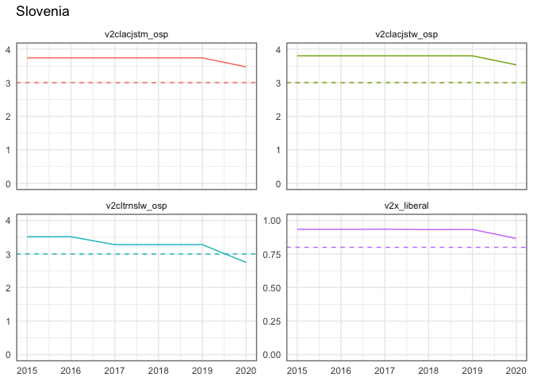
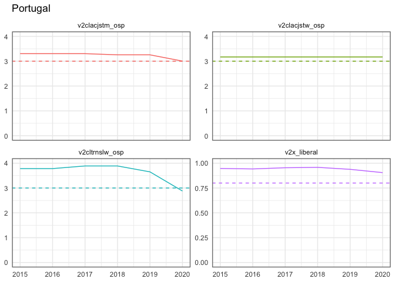
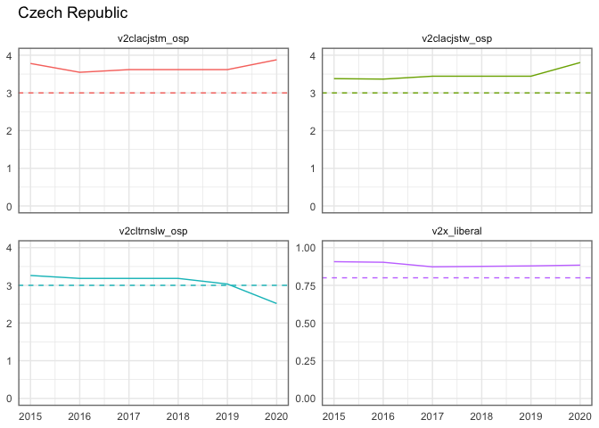
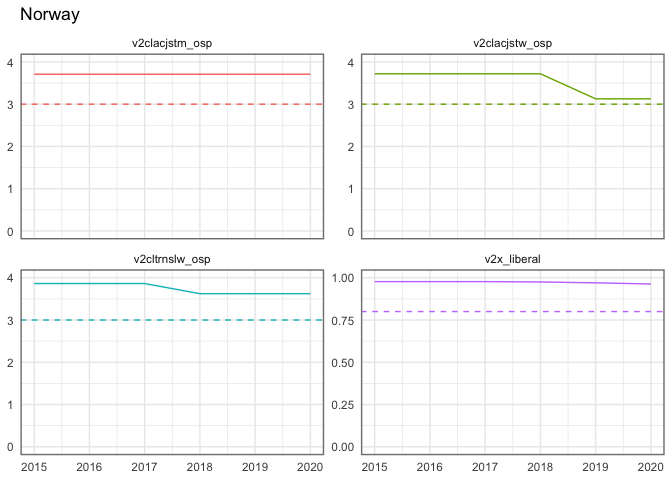
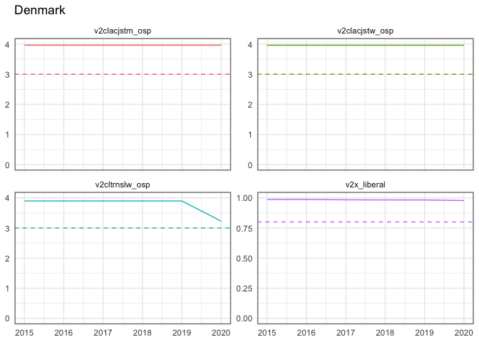

Europe note
================
Andreas Beger
2021-03-24

Several countries in Europe have high values for the risk of an adverse
regime transition (ART) in 2021-2022. These including “surprising”
countries like Norway and Denmark, which rank at 11 and 15,
respectively.

Are these indicative for mistakes or shortcomings in the PART forecast
model, or do they appear to be legitimately high risk cases?

(And one should note that although ranking high in terms of relative
risk, the actual estimated probabilities of an ART are still relatively
low, 16 - 12% for the 4 cases I will look at in more detail below)

``` r
suppressPackageStartupMessages({
  library(dplyr)
  library(tidyr)
  library(vdemdata)
  library(ggplot2)
  library(here)
})

fcast <- read.csv(here::here("archive/forecasts-v11.csv"))
fcast <- fcast %>%
  mutate(rank = nrow(.) - rank(prob) + 1)

part <- read.csv(here::here("archive/part-v11.csv"))
part <- part %>%
  select(gwcode, year, country_name, lagged_v2x_regime, v2x_regime, any_neg_change)

vdem <- readRDS(here("create-data/input/V-Dem-CY-Full+Others-v11.rds"))
keep <- c("country_name", "year", "v2x_regime", "v2x_liberal", "v2cltrnslw_osp",
          "v2clacjstm_osp", "v2clacjstw_osp", "v2x_polyarchy", "v2elfrfair_osp",
          "v2elmulpar_osp")
vdem <- vdem[vdem$year > 1990, keep]
```

Looking at the forecasts, there are several European countries that rank
relatively highly in the forecasts for 2021-2022. Does this make sense?

``` r
fcast$rank[fcast$country_name %in% c("Norway", "Denmark", "Italy", "Slovenia")]
```

    ## [1] 11 15 17 19

``` r
fcast$prob[fcast$country_name %in% c("Norway", "Denmark", "Italy", "Slovenia")]
```

    ## [1] 0.1608002 0.1474036 0.1242046 0.1210460

## Were there similar cases with actual ARTs in 2020?

For 2020 we already have observed cases of ARTs. Were any of them in
Europe?

In 2020 there were observed adverse regime transitions (ARTs) in 4
countries: Czech Republic, Portugal, Ivory Coast, and Slovenia.

``` r
part %>%
  filter(year==2020, any_neg_change==1)
```

    ##   gwcode year   country_name lagged_v2x_regime v2x_regime any_neg_change
    ## 1    235 2020       Portugal                 3          2              1
    ## 2    437 2020    Ivory Coast                 2          1              1
    ## 3    316 2020 Czech Republic                 3          2              1
    ## 4    349 2020       Slovenia                 3          2              1

CR, Portugal and Slovenia all went from liberal democracy
(v2x\_regime=3) to electoral democracy (v2x\_regime=2).

The conditions separating the liberal and electoral democracy regimes of
the worl (RoW) categories are based on 4 indicators. A country is a
liberal, not electoral democracy, if:

    v2x_liberal > .8 AND
    v2cltrnslw_osp > 3 AND
    v2clacjstm_osp > 3 AND
    v2clacjstw_osp > 3

Some helper functions to make it easier to look at the data:

``` r
thresholds <- tibble(
  indicator = c("v2x_liberal", "v2cltrnslw_osp", "v2clacjstm_osp",
                "v2clacjstw_osp"),
  bar = c(.8, 3, 3, 3)
)

# Diagnostic plot showing the 4 indicators separating liberal from electoral
# democracy.
# data: vdem data
libdem_diagnostic <- function(country = "Portugal", data = vdem) {
  dat <- data[data$country_name==country, ]
  dat <- tail(dat, 6)
  dat <- dat %>%
    pivot_longer(v2x_liberal:v2clacjstw_osp, names_to = "indicator")

  dummy_data <- tibble(
    indicator = rep(c("v2x_liberal", "v2cltrnslw_osp", "v2clacjstm_osp",
                      "v2clacjstw_osp"), each = 2),
    year = 2015,
    value = c(0, 1, rep(c(0, 4), 3))
  )

  ggplot(dat, aes(x = year, y = value, color = indicator)) +
    geom_line() +
    facet_wrap(~indicator, scales = "free_y") +
    geom_blank(data = dummy_data) +
    geom_hline(data = thresholds, aes(yintercept = bar, color = indicator),
               linetype = 2) +
    theme_minimal() +
    theme(panel.border = element_rect(colour = "gray50", fill=NA, size=1)) +
    scale_color_discrete(guide = FALSE) +
    labs(x = NULL, y = NULL, title = country)
}
```

Show the critical data for the 3 European cases that had an ART in 2020.
In the plots, the dotted lines indicate the points below which a regime
goes from liberal to electoral democracy.

``` r
libdem_diagnostic("Slovenia")
```

<!-- -->

``` r
libdem_diagnostic("Portugal")
```

<!-- -->

``` r
libdem_diagnostic("Czech Republic")
```

<!-- -->

All three European cases were due to decreases in the transparent laws
with predictable enforcement index (`v2cltrnslw_osp`). Portugal went
from 3.7 to 2.9, Slovenia 3.3 to 2.7, and Czech Republic from 3 to 2.5.

``` r
var_info("v2cltrnslw")[c("name", "question")]
```

    ## $name
    ## [1] "Transparent laws with predictable enforcement"
    ## 
    ## $question
    ## [1] "Are the laws of the land clear, well publicized, coherent (consistent with each other), relatively stable from year to year, and enforced in a predictable manner?"

Ivory Coast went from electoral to closed democracy; not relevant for
Denmark & co so I won’t dig in.

## Re-check 2021-2022 “surprising” high forecasts

Let’s turn back to the cases that I wanted to check.

``` r
libdem_diagnostic("Norway")
```

<!-- -->

``` r
vdem %>% filter(country_name=="Norway") %>% tail(6)
```

    ##    country_name year v2x_regime v2x_liberal v2cltrnslw_osp v2clacjstm_osp
    ## 25       Norway 2015          3       0.977          3.863          3.709
    ## 26       Norway 2016          3       0.977          3.863          3.709
    ## 27       Norway 2017          3       0.977          3.863          3.709
    ## 28       Norway 2018          3       0.975          3.623          3.709
    ## 29       Norway 2019          3       0.970          3.623          3.709
    ## 30       Norway 2020          3       0.963          3.623          3.709
    ##    v2clacjstw_osp v2x_polyarchy v2elfrfair_osp v2elmulpar_osp
    ## 25          3.719         0.899             NA             NA
    ## 26          3.719         0.899             NA             NA
    ## 27          3.719         0.896          3.802          3.929
    ## 28          3.719         0.889             NA             NA
    ## 29          3.127         0.895             NA             NA
    ## 30          3.127         0.899             NA             NA

Norway’s access to justice for women went from 3.7 to 3.1 in 2019.

``` r
var_info("v2clacjstw")[c("name", "question")]
```

    ## $name
    ## [1] "Access to justice for women"
    ## 
    ## $question
    ## [1] "Do women enjoy equal, secure, and effective access to justice?"

``` r
var_info("v2clacjstm")[c("name", "question")]
```

    ## $name
    ## [1] "Access to justice for men"
    ## 
    ## $question
    ## [1] "Do men enjoy secure and effective access to justice?"

``` r
libdem_diagnostic("Denmark")
```

<!-- -->

``` r
vdem %>% filter(country_name=="Denmark") %>% tail(6)
```

    ##    country_name year v2x_regime v2x_liberal v2cltrnslw_osp v2clacjstm_osp
    ## 25      Denmark 2015          3       0.987          3.898          3.965
    ## 26      Denmark 2016          3       0.987          3.898          3.965
    ## 27      Denmark 2017          3       0.984          3.898          3.965
    ## 28      Denmark 2018          3       0.983          3.898          3.965
    ## 29      Denmark 2019          3       0.983          3.898          3.965
    ## 30      Denmark 2020          3       0.978          3.228          3.965
    ##    v2clacjstw_osp v2x_polyarchy v2elfrfair_osp v2elmulpar_osp
    ## 25          3.963         0.915          3.803          3.934
    ## 26          3.963         0.913             NA             NA
    ## 27          3.963         0.913             NA             NA
    ## 28          3.963         0.913             NA             NA
    ## 29          3.963         0.910          3.784          3.936
    ## 30          3.963         0.910             NA             NA

Denmark’s transparent laws index went from 3.9 to 3.2 in 2020.

``` r
libdem_diagnostic("Italy")
```

<!-- -->

``` r
vdem %>% filter(country_name=="Italy") %>% tail(6)
```

    ##    country_name year v2x_regime v2x_liberal v2cltrnslw_osp v2clacjstm_osp
    ## 25        Italy 2015          3       0.921          3.137          3.794
    ## 26        Italy 2016          3       0.920          3.137          3.794
    ## 27        Italy 2017          3       0.926          3.137          3.794
    ## 28        Italy 2018          3       0.919          3.137          3.794
    ## 29        Italy 2019          3       0.920          3.137          3.794
    ## 30        Italy 2020          3       0.918          3.137          3.808
    ##    v2clacjstw_osp v2x_polyarchy v2elfrfair_osp v2elmulpar_osp
    ## 25          3.733         0.866             NA             NA
    ## 26          3.733         0.870             NA             NA
    ## 27          3.733         0.868             NA             NA
    ## 28          3.733         0.867          3.902           3.96
    ## 29          3.733         0.860             NA             NA
    ## 30          3.733         0.861             NA             NA

Italy has been low for a while on the transparent law index, with a
value of 3.1. Slovenia already went to electoral dem in 2020. Now the
risk is about further going to electoral autocracy.

For 2020, Hungary, Montenegro, and Serbia are coded as electoral
democracies, so in a basic sense this doesn’t seem outside of the realm
of the possible.

``` r
vdem %>% filter(year==2020) %>%
  filter(country_name %in% c("Poland", "Hungary", "Slovenia", "Serbia",
                             "Montenegro", "Bosnia and Herzegovina")) %>%
  select(country_name, year, v2x_regime)
```

    ##             country_name year v2x_regime
    ## 1                 Poland 2020          2
    ## 2 Bosnia and Herzegovina 2020          2
    ## 3             Montenegro 2020          1
    ## 4                 Serbia 2020          1
    ## 5               Slovenia 2020          2
    ## 6                Hungary 2020          1

Any of these three indicators put us on the path to autocracy. The
thresholds are 0.5 for polyarchy and 2 for the others.

``` r
vdem %>%
  filter(country_name=="Slovenia", year %in% c(2015:2020)) %>%
  select(v2x_polyarchy, v2elfrfair_osp, v2elmulpar_osp)
```

    ##   v2x_polyarchy v2elfrfair_osp v2elmulpar_osp
    ## 1         0.879             NA             NA
    ## 2         0.865             NA             NA
    ## 3         0.849          3.873           3.95
    ## 4         0.838          3.748           3.95
    ## 5         0.805             NA             NA
    ## 6         0.748             NA             NA

Missing values aside (which we carry forward impute in the PART data),
does not really seem like Slovenia is very close on any of these. In the
three cases for 2021-2022 that are subject to moving from liberal to
electoral democracy–Norway, Denmark, and Italy–one of the indicators
that could push a country across the categories is approaching the
relevant threshold.

The other country I wanted to check, Slovenia, already had an ART in
2020, going to electoral democracy. It would now be at risk of going to
electoral autocracy. It doesn’t really seem very close on any of the 3
indices that could push it down; but on the other hand also not very far
away.

Overall, it seems that the high forecasts, although maybe surprising,
are not the result of some kind of error.
