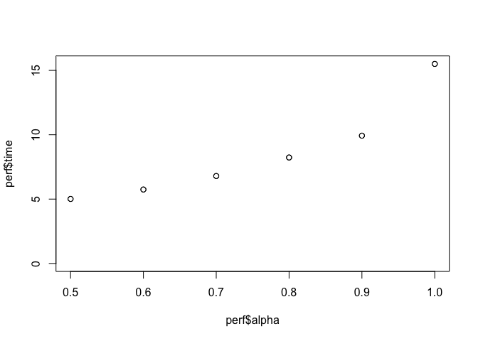

Tuning results for glmnet (model 3)
================

``` r
suppressPackageStartupMessages({
  library(dplyr)
  library(tidyr)
  library(here)
})


perf <- readRDS(here::here("Models/output/tuning/model3-tuning.rds"))

# overall best performance for each measure?
perf %>%
  pivot_longer(cols = -c(alpha, lambda_criterion, lambda, non_zero)) %>%
  group_by(name) %>%
  mutate(
    min_value = min(value),
    max_value = max(value),
    optim_value = case_when(
    name %in% c("mse", "Brier", "Logloss", "time") ~ min(value),
    TRUE ~ max(value))
  ) %>%
  filter(value==optim_value)
```

    ## # A tibble: 8 x 9
    ## # Groups:   name [7]
    ##   alpha lambda_criterion  lambda non_zero name   value min_value max_value
    ##   <dbl> <chr>              <dbl>    <int> <chr>  <dbl>     <dbl>     <dbl>
    ## 1   1   min              0.00266       73 Accu… 0.968     0.965     0.968 
    ## 2   0.8 min              0.00333       75 mse   0.0574    0.0574    0.0607
    ## 3   0.8 min              0.00333       75 Brier 0.0287    0.0287    0.0304
    ## 4   0.8 min              0.00333       75 Logl… 0.115     0.115     0.126 
    ## 5   0.8 min              0.00333       75 AUC_… 0.864     0.843     0.864 
    ## 6   0.6 min              0.00444       80 AUC_… 0.291     0.255     0.291 
    ## 7   0.5 min              0.00533       82 time  5.01      5.01     15.5   
    ## 8   0.5 1se              0.0215        17 time  5.01      5.01     15.5   
    ## # … with 1 more variable: optim_value <dbl>

``` r
# this tends to pick min, what if we look at 1se?
perf %>%
  pivot_longer(cols = -c(alpha, lambda_criterion, lambda, non_zero)) %>%
  filter(lambda_criterion=="1se") %>%
  group_by(name) %>%
  mutate(
    min_value = min(value),
    max_value = max(value),
    optim_value = case_when(
      name %in% c("mse", "Brier", "Logloss", "time") ~ min(value),
      TRUE ~ max(value))
  ) %>%
  filter(value==optim_value)
```

    ## # A tibble: 7 x 9
    ## # Groups:   name [7]
    ##   alpha lambda_criterion lambda non_zero name   value min_value max_value
    ##   <dbl> <chr>             <dbl>    <int> <chr>  <dbl>     <dbl>     <dbl>
    ## 1   1   1se              0.0118       11 mse   0.0604    0.0604    0.0607
    ## 2   1   1se              0.0118       11 Brier 0.0302    0.0302    0.0304
    ## 3   1   1se              0.0118       11 Logl… 0.125     0.125     0.126 
    ## 4   0.5 1se              0.0215       17 Accu… 0.965     0.965     0.965 
    ## 5   0.5 1se              0.0215       17 AUC_… 0.849     0.843     0.849 
    ## 6   0.5 1se              0.0215       17 AUC_… 0.260     0.255     0.260 
    ## 7   0.5 1se              0.0215       17 time  5.01      5.01     15.5   
    ## # … with 1 more variable: optim_value <dbl>

``` r
# alpha really cuts down time below 1
plot(perf$alpha, perf$time, ylim = c(0, max(perf$time)))
```

<!-- -->

``` r
plot(perf$alpha, perf$mse, ylim = c(0, max(perf$mse)))
```

<!-- -->

``` r
plot(perf$alpha, perf$Brier, ylim = c(0, max(perf$Brier)))
```

<!-- -->

``` r
plot(perf$alpha, perf$Logloss, ylim = c(0, max(perf$Logloss)))
```

<!-- -->

``` r
plot(perf$alpha, perf$AUC_PR, ylim = c(0, max(perf$AUC_PR)))
```

<!-- -->

``` r
plot(perf$alpha, perf$non_zero, ylim = c(0, max(perf$non_zero)))
```

<!-- -->

``` r
# the 1se lambda cuts non-zero coefs down to <20, from ~80.
# otherwise lower values of alpha don't seem to really impact performance that
# much.
# So, pick a low value of alpha to speed up training and call it a day,
# take the lambda values from that, and I would say average them so that
# we get a few more non-zero coefs.
plot(perf$lambda, perf$non_zero)
```

<!-- -->

``` r
pick <- perf %>%
  filter(alpha==0.5) %>%
  summarize(alpha = unique(alpha), lambda = mean(lambda)) %>%
  as.list()
pick
```

    ## $alpha
    ## [1] 0.5
    ## 
    ## $lambda
    ## [1] 0.01341932
