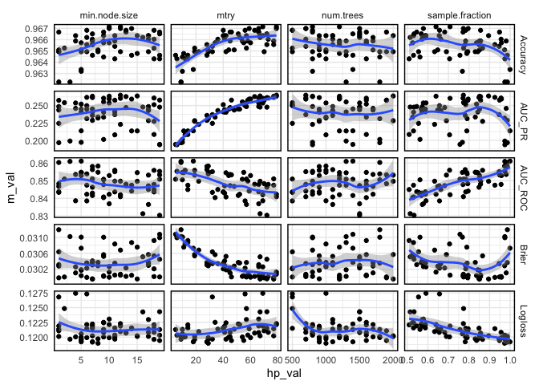

Tuning results for random forest (model 4)
================
andybega
2021-03-13

``` r
suppressPackageStartupMessages({
  library(dplyr)
  library(ggplot2)
  library(tidyr)
  library(here)
})


res <- readRDS(here("Models/output/tuning/model4-tuning.rds"))

res %>%
  select(-row) %>%
  pivot_longer(num.trees:sample.fraction, names_to = "hp", values_to = "hp_val") %>%
  pivot_longer(Brier:AUC_PR, names_to = "measure", values_to = "m_val") %>%
  ggplot(aes(x = hp_val, y = m_val, group = interaction(hp, measure))) +
  facet_grid(measure ~ hp, scales = "free") +
  geom_point() +
  geom_smooth() +
  theme_minimal() +
  theme(panel.border = element_rect(colour = "black", fill=NA, size=1))
```

    ## `geom_smooth()` using method = 'loess' and formula 'y ~ x'

<!-- -->

``` r
# Prior to v11, num.trees and mtry were tuned using a self-tuning model
# (`mlr`'s `TuneWrapper`). Doesn't make much sense to tune num.trees. A value
# of 1,000 seems to be sufficient. Tune the other three parameters instead.
```
