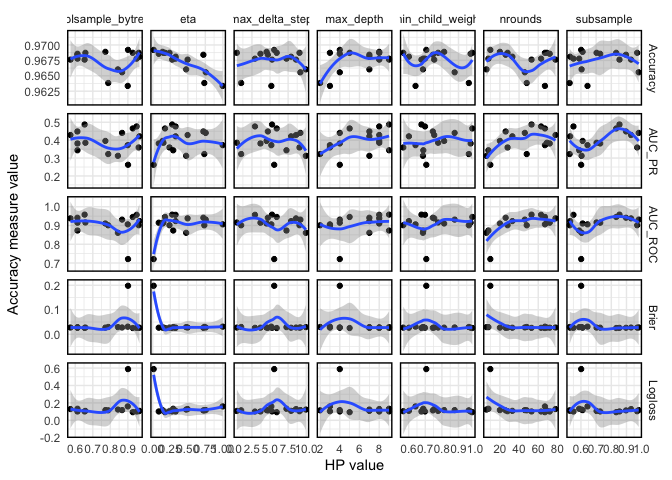

xgboost (model 5) tuning results
================
andybega
2021-03-13

``` r
suppressPackageStartupMessages({
  library(dplyr)
  library(ggplot2)
  library(tidyr)
  library(here)
})


res <- readRDS(here("Models/output/tuning/model5-tuning.rds"))
# Total number of tuning samples
print(nrow(res))
```

    ## [1] 16

``` r
res %>%
  pivot_longer(nrounds:alpha, names_to = "hp", values_to = "hp_val") %>%
  # filter out HP that are constant, i.e. not being tuned
  group_by(hp) %>%
  filter(length(unique(hp_val)) > 1) %>%
  ungroup() %>%
  pivot_longer(Brier:AUC_PR, names_to = "measure", values_to = "m_val") %>%
  ggplot(aes(x = hp_val, y = m_val, group = interaction(hp, measure))) +
  facet_grid(measure ~ hp, scales = "free") +
  geom_point() +
  geom_smooth() +
  theme_minimal() +
  labs(y = "Accuracy measure value", x = "HP value") +
  theme(panel.border = element_rect(colour = "black", fill=NA, size=1))
```

    ## `geom_smooth()` using method = 'loess' and formula 'y ~ x'

<!-- -->
